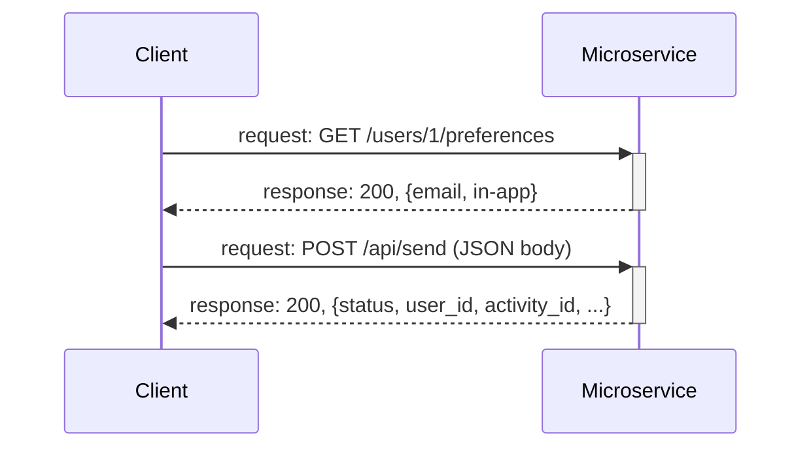

# notification-microservice

Notification microservice for task/activity updates. In-app and email (Mailgun) channels.

## Run locally

1. Create a virtualenv and install dependencies:
   ```bash
   python3 -m venv venv
   source venv/bin/activate   # or `venv\Scripts\activate` on Windows
   python3 -m pip install -r requirements.txt
   ```

2. For email, copy `.env.example` to `.env` and set `MAILGUN_API_KEY` and `MAILGUN_DOMAIN`.

3. Start the server:
   ```bash
   python3 app.py
   ```
   Server listens on `http://0.0.0.0:3000` (set `PORT` to override).

## How to request data from the microservice

Send HTTP requests to the endpoints below. The client and service are separate—no direct calls, just HTTP.

**Example — GET preferences:**
```bash
curl -X GET http://localhost:3000/users/1/preferences
```

**Example — POST send:**
```bash
curl -X POST http://localhost:3000/api/send \
  -H "Content-Type: application/json" \
  -d '{"user_id": 123, "activity_id": 456, "notification_type": "activity_completed"}'
```

Or run the test client (server must be up first):
```bash
python3 test_client.py
```

## How to receive data from the microservice

Responses are JSON. Read the response body and parse it; status code tells you success (200) or error (4xx/5xx).

**Example — preferences response:**
```json
{"email": true, "in-app": true}
```

**Example — in Python:**
```python
import requests
resp = requests.get("http://localhost:3000/users/1/preferences")
resp.raise_for_status()
data = resp.json()
print(data)
```

**Example — send response:**
```json
{
  "status": "success",
  "user_id": "123",
  "activity_id": "456",
  "notification_type": "activity_completed",
  "timestamp": "2026-02-23T12:00:00Z",
  "error_message": null
}
```

## Request / response flow (UML sequence diagram)



Client and service talk over HTTP only.

## API

### POST /api/send

Send a notification when a task/activity is completed.

**Request body (JSON):**

| Field              | Required | Description                                        |
|--------------------|----------|----------------------------------------------------|
| `user_id`          | Yes      | ID of the user to notify                           |
| `activity_id`      | Yes      | ID of the task or activity                         |
| `notification_type` | Yes    | e.g. `activity_completed`                          |
| `channel`          | No       | Preferred channel(s): `["email", "in-app"]`        |
| `email`            | No       | Recipient email (required when using email channel) |

**Example:**
```bash
curl -X POST http://localhost:3000/api/send \
  -H "Content-Type: application/json" \
  -d '{"user_id": 123, "activity_id": 456, "notification_type": "activity_completed", "channel": ["email", "in-app"], "email": "user@example.com"}'
```

**Response (JSON):**
```json
{
  "status": "success",
  "user_id": "123",
  "activity_id": "456",
  "notification_type": "activity_completed",
  "timestamp": "2026-02-23T12:00:00Z",
  "error_message": null
}
```
On failure, `status` is `"failure"` and `error_message` contains the reason.

### GET /health

Health check; returns `{"status": "ok"}`.

### GET /users/<user_id>/preferences

Return notification channel preferences for a user. Response: `{"email": true, "in-app": true}` (or false for disabled).

### PATCH /users/<user_id>/preferences

Update preferences. Body: `{"email": false, "in-app": true}`. Only known channels are applied. Returns updated preferences.

---

## Teammate: Preferences storage

Preferences use `preferences/store.py` for persistence (in-memory by default). To persist with SQLite, replace the implementation in `store.py`; see **Teammate task: Persist preferences with SQLite** in `TEAM_SETUP.md`.
